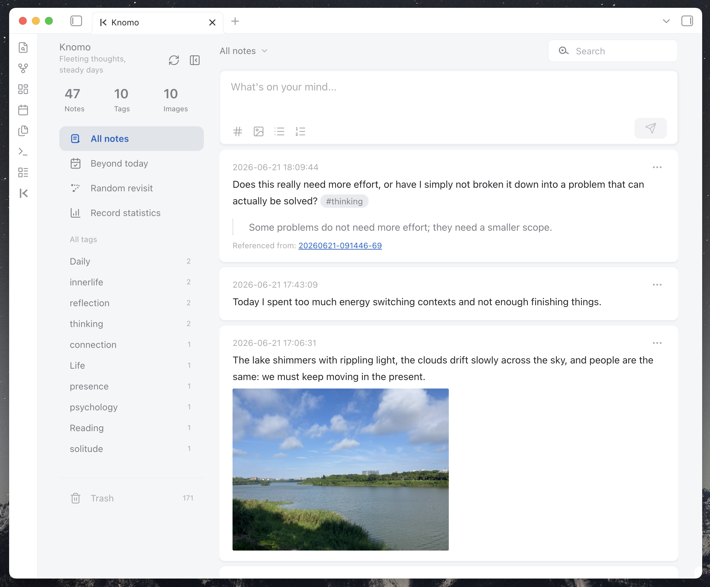
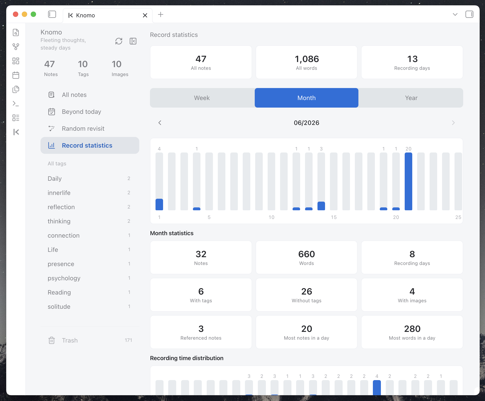
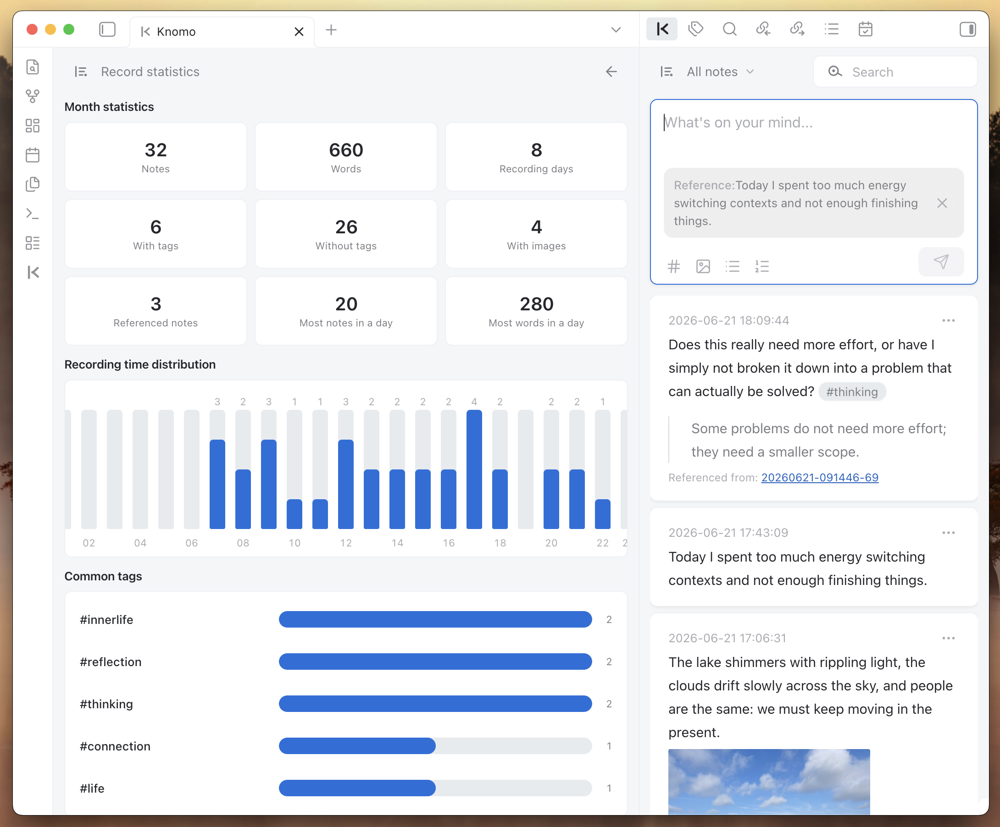
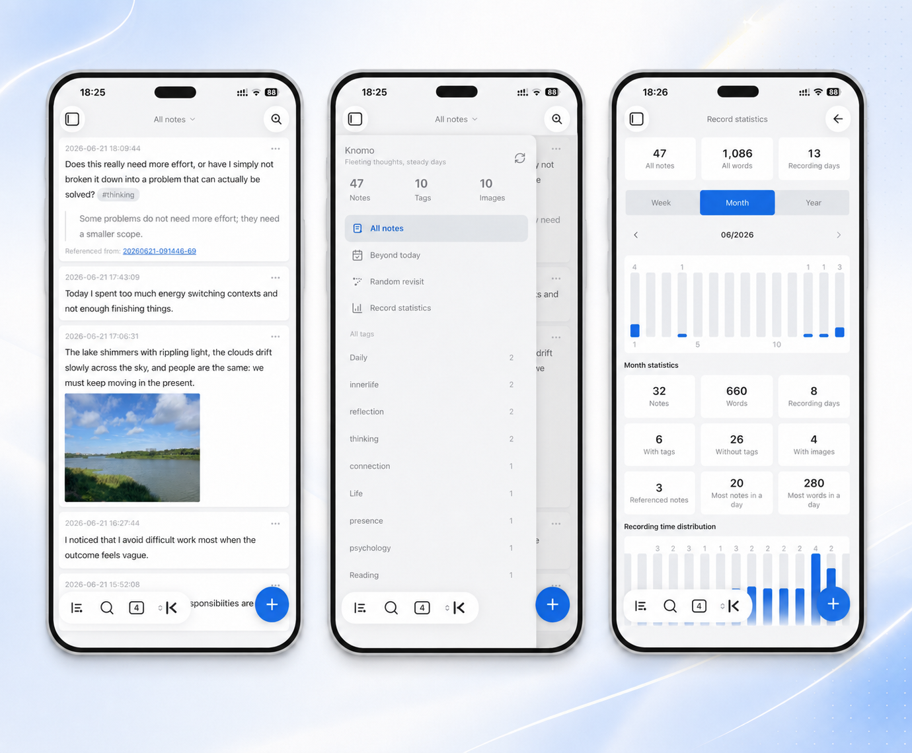

# Knomo

English | [简体中文](./README.zh-CN.md)

> A local-first Memos entry for Obsidian: quick capture, Daily Note context, monthly Markdown collection, card review, and mobile-friendly input.

Knomo is a memo-first capture plugin for Obsidian. It helps you write down fragmented thoughts quickly while keeping the content inside your own Vault, in regular Markdown files that remain readable and editable outside the plugin.

Knomo is built around a simple idea:

- Write quickly, without deciding the final note structure first;
- Keep every memo in the context of the day through Daily Notes;
- Automatically collect memos into monthly Markdown files for browsing and review;
- Use cards, filters, search, references, images, tasks, and statistics to rediscover and reuse what you wrote;
- Stay local-first and non-destructive.

Knomo does not try to replace Obsidian's files, folders, tags, links, backlinks, or Daily Notes. It provides a lighter capture layer on top of Obsidian's Markdown workflow.

---

## Screenshots

### Desktop







### Mobile




---

## Why Knomo?

Obsidian is excellent for long-term knowledge management, but many thoughts do not arrive as polished notes. They arrive as fragments: a sentence from reading, a meeting idea, a task, a screenshot, a link, a small decision, a feeling, or a half-formed connection.

If every fragment requires opening the right file, finding the right heading, choosing the right folder, and deciding the final structure, many of them never get written down.

Knomo gives those fragments a low-friction entry point:

1. **Capture first** — open Knomo, write a memo, save it.
2. **Keep daily context** — the memo is written to the Daily Note of the day.
3. **Collect by month** — Knomo maintains monthly Memos Markdown files for centralized browsing.
4. **Review as cards** — use the card flow, filters, search, and statistics to revisit what you wrote.
5. **Return to Markdown** — every memo remains part of your local Obsidian workflow.

---

## Core Principles

### Memo-first

Knomo treats the memo as the first capture unit. You can record first, then later connect, tag, search, reference, develop, or move content into larger notes.

### Daily Note + Monthly Memos

Knomo's core workflow has two Markdown layers:

- **Daily Note**: preserves when and where the memo happened;
- **Monthly Memos file**: collects memos into a month-level stream for browsing and review.

Daily Notes answer: **What happened today?**

Monthly Memos answer: **What did I write down this month?**

### Local-first

Memo content is stored in your Obsidian Vault. Knomo does not require an account, does not rely on an external server, and does not actively upload your notes.

### Markdown-friendly

Knomo tries to support and preserve common Obsidian / Markdown syntax, including tags, internal links, Markdown links, URLs, images, lists, task lists, block references, quotes, headings, and code blocks.

### Non-destructive

Knomo does not turn your Daily Notes into a private database. It writes memo-shaped Markdown and keeps the original content readable.

### Mobile-friendly

Knomo treats Obsidian mobile as a core use case, not as a smaller desktop window. The composer, keyboard behavior, touch targets, sidebar, search, and card browsing are optimized for mobile capture.

---

## Feature Highlights

### Quick capture

Write and save memos directly inside Knomo without opening a Markdown file first.

Good for:

- fleeting thoughts;
- reading excerpts;
- project ideas;
- meeting notes;
- work reminders;
- daily review material;
- temporary notes to process later.

---

### Daily Note writing

Knomo depends on Obsidian's core **Daily Notes** plugin.

New memos are written under a configured heading in the Daily Note of the day. The default heading is:

```md
## Memos
```

Example:

```md
## Memos

- 18:30:12 I came up with a new product idea #idea
- 21:10:03 This paragraph from a book is worth revisiting #reading
```

You can configure the heading, insertion position, and time format in Knomo settings.

---

### Monthly Memos files

In addition to Daily Notes, Knomo automatically maintains monthly Memos Markdown files.

Default example:

```md
# Knomo/Memos-2026-06.md

## [[2026-06-21]]

- 09:20:10 A small product idea that should not be lost #idea
- 22:15:42 Review note: this needs to become a project brief later #review

## [[2026-06-20]]

- 16:42:03 Useful quote from reading #reading
```

Monthly files make it easier to browse a long memo stream without losing the daily source context.

---

### Card-based browsing

Knomo displays memos as cards instead of forcing you to read the raw Markdown stream.

Cards are useful for:

- quickly browsing recent memos;
- reading on mobile;
- scanning search results;
- filtering by tags, links, images, or date ranges;
- opening the source Daily Note;
- copying text or links;
- editing, deleting, restoring, or referencing a memo.

---

### Filters and search

Knomo supports multiple ways to narrow down your memo stream:

- all notes;
- untagged memos;
- memos with links;
- memos with images;
- on-this-day / anniversary review;
- recent ranges such as this week, this month, last 7 days, last 30 days, last week, and last month;
- tag filtering;
- keyword search;
- statistics-driven filters.

For large Vaults, Knomo can load recent content first and then hydrate the full memo set for filters and statistics that require all data.

---

### Tags, links, and backlinks-friendly Markdown

Knomo recognizes tags and links written inside memos.

```md
- 16:20:00 Improve the mobile composer spacing #knomo #interaction
- 19:05:00 This connects to [[Product Design]] and [[Mobile UX]]
- 20:10:00 Reference: https://obsidian.md
```

Knomo preserves the original Markdown instead of replacing it with a private format.

---

### Reference cards

When a memo should respond to or build on another memo, Knomo can create a reference from the card action menu.

This is useful when you want to:

- continue an old thought;
- cite a previous memo in a new memo;
- connect scattered fragments over time;
- keep the original source memo traceable.

References use Obsidian-friendly links or block references so the connection remains meaningful outside Knomo.

---

### Image preview

Knomo supports lightweight image previews in memo cards.

Supported use cases include:

- local Obsidian embeds such as `![[image.png]]`;
- regular Markdown images such as ``;
- multiple images in one memo;
- opening a larger preview from the card;
- switching between images in the preview.

The goal is not to become an image manager. Knomo only provides compact previews so image-based memos remain easy to browse.

---

### Task lists and checkboxes

Knomo supports Markdown task lists inside memos.

Example:

```md
- 09:30:00
	- [ ] Send the project note
	- [x] Check yesterday's meeting memo
```

Task status can be updated from the card view and synced back to the source Markdown content.

---

### Record statistics

Knomo includes a record statistics view for understanding your memo habits and reviewing your writing rhythm.

It can show:

- total notes;
- total words;
- recording days;
- notes with tags;
- notes without tags;
- notes with images;
- referenced notes;
- busiest days by note count;
- wordiest days;
- weekly, monthly, and yearly trends;
- recording time distribution;
- common tags.

Statistics are designed for review and navigation, not for turning writing into a productivity scoreboard. You can use statistics to notice patterns and jump back into related memo cards.

---

### Random revisit and review

Knomo includes lightweight review entry points such as random revisit and date-based review. They are designed to help old fragments meet the present again without requiring AI or external services.

A memo does not need to become useful immediately. Sometimes its value appears when you encounter it again in a different context.

---

### Shuffle day

Shuffle day brings back one complete day from at least seven days ago and displays that day's memos in chronological order. It favors varied dates and avoids immediately repeating recently shown days when possible.

Alongside the memo cards, Knomo summarizes the day's memo count, word count, tags, images, and links. Selection happens entirely from your local memo index, without AI or external services.

---

### Time buoy

Add `@YYYY-MM-DD` to a memo to make it surface on a chosen date. You can type the marker directly or use the date picker in the composer, then review buoys in **Today**, **Upcoming**, and **Past** views.

The date marker remains part of the memo's Markdown content. Knomo only builds a local, removable, and rebuildable index for fast lookup; the index does not replace or rewrite the source memo in your Daily Note.

---

### Trash, restore, and repair

Knomo includes safer maintenance flows for day-to-day use:

- deleted memos can appear in Trash;
- memos can be restored when possible;
- permanent deletion requires a separate action;
- the memo index can be repaired from Markdown sources;
- legacy Daily Note memo-shaped content can be previewed and imported.

Markdown remains the long-term trusted source. The plugin index is used to improve browsing, filtering, and synchronization.

---

### Mobile input experience

Knomo has dedicated mobile interaction improvements:

- touch-friendly quick create entry;
- bottom composer designed for phone input;
- better coordination with the system keyboard;
- long-content height and scrolling control;
- larger touch targets;
- mobile search page;
- mobile sidebar drawer;
- mobile-friendly image preview;
- adaptation for safe areas and Obsidian mobile navigation bars.

Knomo's mobile goal is not just to open inside Obsidian mobile, but to make quick memo capture feel natural there.

---

### Theme compatibility

Knomo uses Obsidian theme variables where possible and includes compatibility work for community themes such as Minimal.

If you use a different theme and see spacing, color, contrast, or mobile layout issues, feedback is welcome.

---

## Installation

### Install from Obsidian Community Plugins

When Knomo is available in the Obsidian community plugin marketplace:

1. Open Obsidian Settings;
2. Go to **Community plugins**;
3. Turn off Restricted Mode if needed;
4. Search for `Knomo`;
5. Install and enable the plugin.

### Manual installation

1. Download the latest release files:
   - `main.js`
   - `manifest.json`
   - `styles.css`
2. Create this folder in your Vault:

```text
.obsidian/plugins/knomo/
```

3. Put the three files into the folder;
4. Restart Obsidian;
5. Enable Knomo in **Community plugins**;
6. Run `Open Knomo` from the command palette.

---

## Quick Start

### 1. Enable Daily Notes

Knomo requires Obsidian's core **Daily Notes** plugin.

Before using Knomo, make sure:

- Daily Notes is enabled;
- the Daily Notes folder is configured;
- the date format is configured;
- Obsidian can create Daily Note files normally.

### 2. Open Knomo

You can open Knomo by:

- clicking the Ribbon icon;
- running `Open Knomo` from the command palette;
- pinning the Knomo view to your workspace.

### 3. Create your first memo

Write:

```text
Today I started using Knomo to capture small thoughts #knomo
```

After saving, the memo appears in the card flow and is written to the corresponding Markdown files.

### 4. Review and connect

After writing for a while, try:

- filtering by tags;
- searching keywords;
- opening memos with links or images;
- using Random revisit;
- checking Record statistics;
- referencing an older memo when creating a new one.

---

## Markdown Format

Knomo uses simple Markdown that stays readable outside the plugin.

### Single-line memo

```md
- 18:30:12 This is a memo
```

### Multi-line memo

```md
- 18:30:12 First line
	Second line
	Third line
```

### Memo with tags

```md
- 18:30:12 I read a useful point today #reading #product
```

### Memo with links

```md
- 18:30:12 This connects to [[Product Design]] and https://obsidian.md
```

### Memo with image

```md
- 18:30:12 Inspiration screenshot ![[image.png]]
```

### Memo with task list

```md
- 09:30:00
	- [ ] Follow up with the project owner
	- [x] Check yesterday's memo
```

### Memo with quote

```md
- 20:15:00
	> A small note can become useful when it returns at the right time.
```

### Monthly archive

```md
## [[2026-06-21]]

- 18:30:12 This is a memo
```

---

## Settings Overview

Knomo settings include:

- Daily Note insertion heading;
- new memo insertion position;
- memo time format;
- monthly memos folder;
- monthly memos filename format;
- date heading format inside monthly files;
- monthly date sort order;
- optional exclusion of monthly memo files from Obsidian search / graph / statistics;
- pinned tags;
- legacy Daily Note memo import;
- data repair and rebuild tools.

---

## Data and Privacy

Knomo's core principle is: **your data belongs to you**.

- Memo content is stored in your Obsidian Vault;
- Daily Notes and monthly Memos files are regular Markdown files;
- Markdown files can be read, backed up, synced, and migrated directly;
- the plugin index improves browsing, filtering, statistics, and sync behavior;
- the plugin index is not the only source of truth;
- Knomo does not require an account;
- Knomo does not rely on an external server;
- Knomo does not actively upload your notes.

---

## Data Safety Notes

Knomo writes to Markdown files. To reduce risk:

- back up your Vault before first use;
- make sure Obsidian Sync, Git, or other sync tools are working normally;
- back up before importing legacy Daily Note content;
- check the original Markdown if the card flow looks inconsistent;
- use repair / rebuild tools if the index becomes outdated;
- treat Markdown files as the long-term trusted source.

Knomo's goal is not to hide Markdown. It is to make Markdown easier to capture, browse, and reuse.

---

## Recommended Workflows

### Daily fragmented capture

Use Knomo as a quick input box inside Obsidian. Write first; organize later.

### Reading excerpts

```md
- 10:32:00 The important part is not the number of features, but the path users take to complete their goals. #reading #product
```

### Project idea pool

```md
- 16:20:00 The mobile input box should feel like a calm panel above the keyboard. #knomo #interaction
```

### Task capture

```md
- 09:30:00
	- [ ] Draft the release note
	- [ ] Review the mobile card layout
```

### Image-based inspiration

```md
- 18:30:12 Layout reference for a compact card ![[card-layout-reference.png]] #design
```

### Review and reuse

Use tags, search, Random revisit, Record statistics, and references to bring old fragments back into current work.

---

## What Knomo Is Not

Knomo is not:

- a replacement for Obsidian files or folders;
- a cloud memo service;
- an AI note organizer;
- a full task manager;
- an image manager;
- a private database that locks your content away.

Knomo is a local memo-first capture and review layer for Obsidian Markdown.

---

## Differences from Other Tools

### How is Knomo different from flomo?

flomo is a standalone Memos product. Knomo is an Obsidian plugin.

Knomo is more suitable for users who want to keep fragmented notes in their own Vault while continuing to use Obsidian's tags, links, search, backlinks, Daily Notes, and Markdown workflow.

### How is Knomo different from Thino?

Thino is a mature Obsidian Memos plugin.

Knomo focuses more on:

- Daily Note integration;
- monthly Markdown collection;
- local-first memo storage;
- mobile input experience;
- lightweight card review;
- low-friction personal capture.

If you need a mature and feature-rich Memos plugin, Thino may be a better fit. If you want a lightweight memo entry that stays close to Daily Notes and local Markdown, Knomo may fit your workflow.

---

## FAQ

### Will Knomo lock my data inside the plugin?

No. Core memo content is written to Markdown files. The index improves the experience, but Markdown remains the long-term trusted source.

### Do I have to enable Daily Notes?

Yes. Knomo's main writing workflow is built around Obsidian's core Daily Notes plugin.

### Will Knomo upload my notes?

No. Knomo does not rely on external servers and does not actively upload your notes.

### Does Knomo support mobile?

Yes. Mobile is one of Knomo's main optimization areas. Knomo includes a mobile composer, keyboard adaptation, mobile search, touch-friendly controls, safe-area handling, mobile sidebar behavior, and mobile-friendly card browsing.

### Why do my card flow and Markdown files look inconsistent?

The index may not have refreshed yet, or Markdown files may have been edited externally.

Try:

1. checking the original Markdown file;
2. refreshing Knomo;
3. using repair / rebuild tools;
4. opening an issue with reproduction steps if the problem persists.

### Can I edit Markdown files manually?

Yes. Knomo is designed to keep content readable in Markdown. If you edit files manually, refresh or rebuild the index if the card flow does not update as expected.

---

## Development Verification

Before handing off a change, run:

```bash
npm run verify
```

This runs type checking, tests, the production build, i18n checks, diff whitespace checks, Obsidian forbidden source pattern scans, and trailing whitespace scans. For mobile-facing changes, also complete the manual scenarios in [docs/mobile-qa-checklist.md](./docs/mobile-qa-checklist.md).

For focused test loops, pass Node test runner arguments through `npm test`, for example `npm test -- --test-name-pattern=WikiLink`. Run `npm run verify` before handing off the change.

---

## Feedback and Contribution

Feedback is welcome, especially:

- bug reports;
- mobile experience feedback;
- theme compatibility issues;
- Markdown parsing edge cases;
- data sync / index repair issues;
- UI / UX suggestions;
- documentation improvements.

When reporting mobile issues, please include device model, OS version, Obsidian version, theme, and reproduction steps.

---

## License

### Knomo for Obsidian Desktop and Mobile

Knomo is licensed under the MIT License. You are free to use, copy, modify, merge, publish, distribute, sublicense, and/or sell copies of this software, as long as you preserve the copyright and license notice in any substantial portion of the code.

This includes any standalone snippets, styles, components, or utility functions you may extract from Knomo.

If you distribute a fork of Knomo or reuse part of its code, it would be appreciated if you keep a link back to the original project in your README and keep my [Buy me a coffee](https://www.buymeacoffee.com/banyanso) link.

Knomo is designed for Obsidian and may continue to be updated to stay compatible with new versions of Obsidian, including improvements for desktop, mobile, and community themes such as Minimal.

See the [LICENSE](./LICENSE) file for details.
