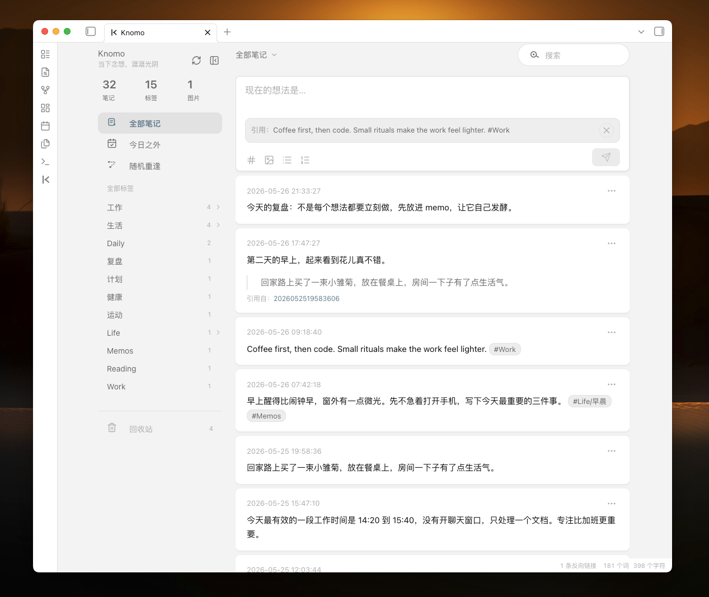
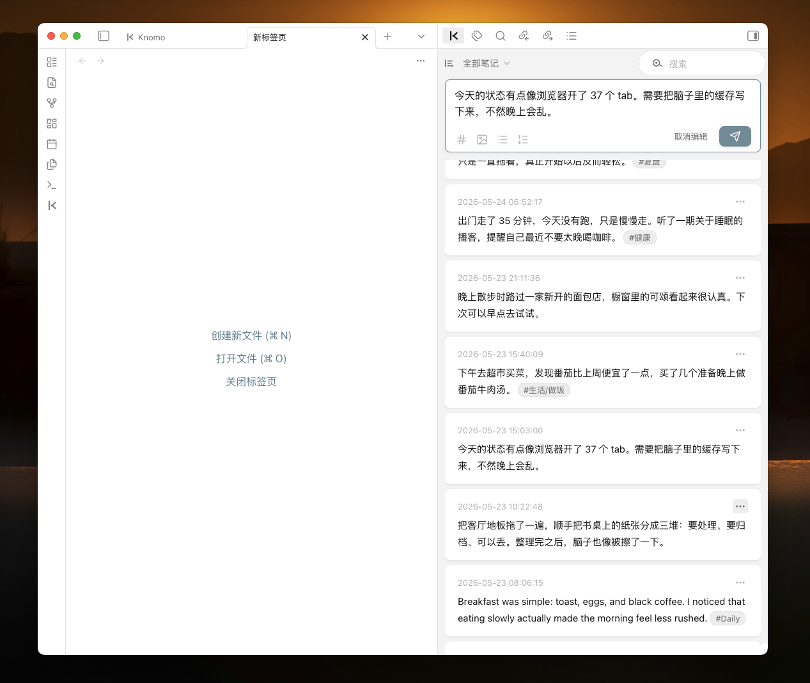
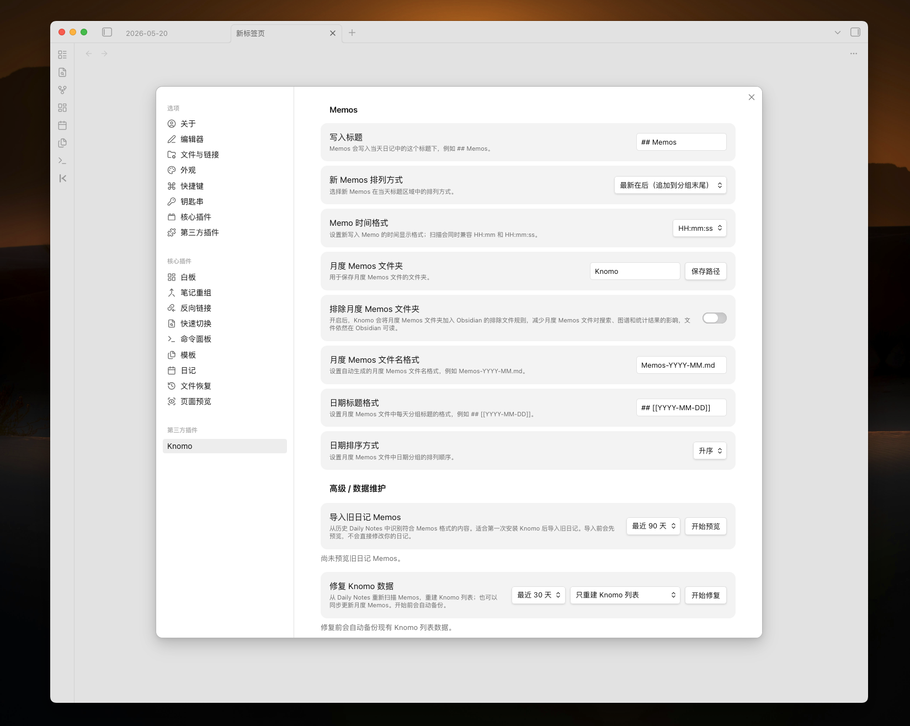
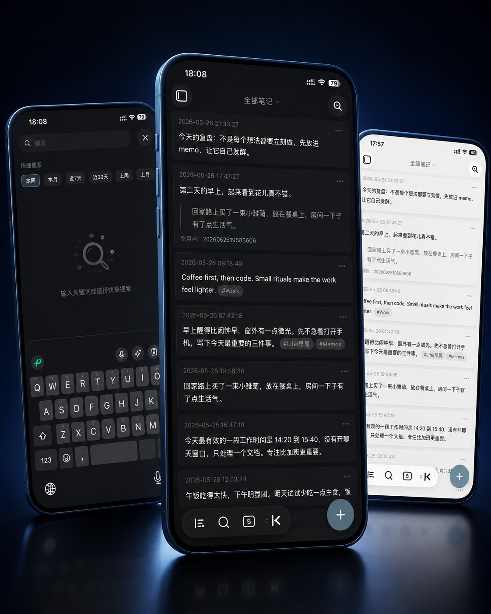
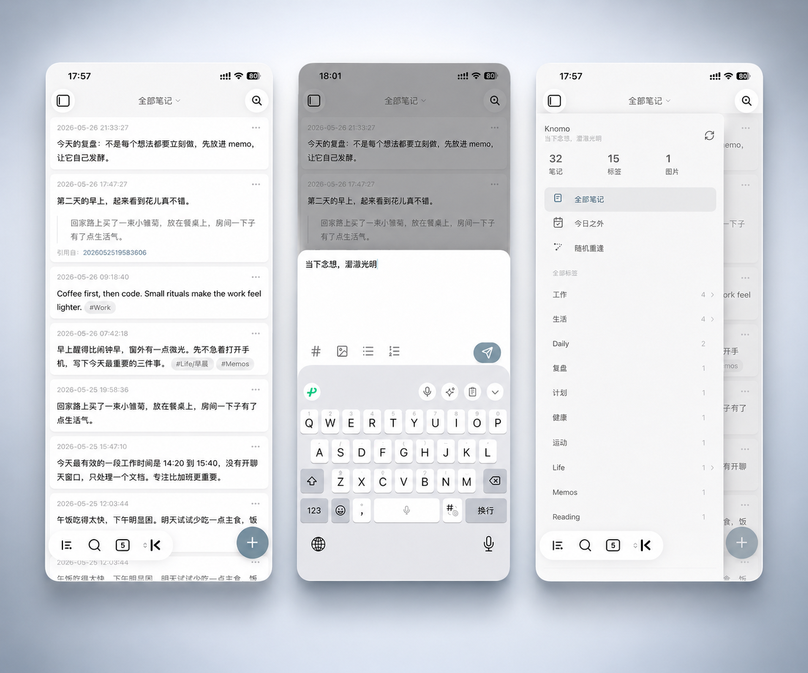

# Knomo

[English](README.md) | 简体中文

> Obsidian 里的轻量 Memos 入口：快速记录，日记留痕，月度归集，本地可控。

Knomo 是一个为 Obsidian 打造的本地 Memo-first 记录插件。它会在你的 Vault 里建立一条更顺手的碎片记录工作流：

- 每条 memo 会自动写入当天的 Daily Note；
- 同时自动生成或更新按月份归集的 Memos Markdown 文件；
- Daily Note 保留当天上下文，月度 Memos 文件用于集中回看；
- memo 内容、Markdown 文件和必要的关联数据都保存在本地库中。

这样，你可以像发一条 memo 一样快速记录，又不会把内容从 Obsidian 的日记、标签、双链和 Markdown 系统中切走。

Knomo 不试图取代 Obsidian 的文件、文件夹、标签、双链和日记系统，也不会自动整理或改写你的 Markdown 内容。它只是提供一个更轻、更顺手的记录入口，让 memo 保持原文进入 Obsidian 的本地 Markdown 工作流。

---

## 名称来源

**Knomo** 来自 **Knowledge** 与 **Memo** 的结合。

它代表的是知识、想法与日常闪念之间的连接：那些还没有变成长文、项目或体系的片段，先以 memo 的形式被记录下来，再在 Obsidian 的本地知识库中慢慢沉淀、关联和复用。

---

## 截图

### 桌面端








### 移动端






---

## 为什么需要 Knomo？

Obsidian 很适合长期知识管理，但很多灵感、摘录、工作备忘和临时想法并不适合一开始就被放进复杂结构里。

Knomo 让这些内容先以 memo 的形式被快速捕捉，然后自动进入 Obsidian 的本地 Markdown 工作流。

它主要解决这几个问题：

### 1. 记录更快

不需要先打开文件、找标题、决定放在哪里。打开 Knomo，写下内容，保存即可。

### 2. 日记不丢上下文

每条 memo 会自动写入当天的 Daily Note，保留在当天发生的真实上下文中。你晚上复盘时，不需要再去别的工具里找当天的碎片记录。

### 3. 月度自动归集

Knomo 会自动生成或更新按月份归集的 Memos Markdown 文件。

Daily Note 负责记录“今天发生了什么”，月度 Memos 文件负责集中展示“这个月写下了什么”。

### 4. 不破坏原有日记结构

Knomo 尽量在指定区域写入 memo，不强行重组你的 Daily Note，也不把日记变成插件专用格式。

### 5. 移动端更顺手

很多碎片想法发生在手机上。Knomo 针对 Obsidian 移动端做了大量交互优化，包括输入、键盘适配、触控按钮、卡片浏览、搜索入口和侧边栏体验。

### 6. 内容仍然在本地库里

memo 内容、月度归集文件和必要的关联数据都保存在你的本地 Vault 中，方便备份、同步、迁移和长期保存。

---

## 核心理念

### Memo-first

Knomo 把 memo 作为第一入口。你先捕捉想法，再通过标签、搜索、日记、月度归集和回顾来查看、定位和复用这些内容。

### Daily Note + Monthly Memos

Knomo 的核心工作流由两部分组成：

- **Daily Note**：记录当天产生的 memo，保留日记上下文；
- **Monthly Memos Markdown 文件**：自动按月份归集 memo，方便集中浏览和长期回看。

这两个文件都保存在你的 Vault 中，可以直接阅读、编辑、备份和迁移。Knomo 会尽量保持 Markdown 原文，不主动做额外整理、分类或内容改写。

### Obsidian Markdown-friendly

Knomo 会尽量支持并保留 Obsidian 常用的 Markdown 写法，例如标签、内部链接、图片嵌入、列表、引用和普通 Markdown 文本。

你在 memo 里写下的内容仍然是 Obsidian 能识别的 Markdown，而不是只属于 Knomo 的私有格式。

### Local-first

你的 memo 内容、Markdown 文件和必要的关联数据都保存在本地库中。Knomo 不依赖外部服务器，不要求注册账号，也不会主动上传你的笔记内容。

### Non-destructive

Knomo 尽量不破坏你原有的 Daily Note 结构，不把日记强行改造成插件专用数据库。

### Mobile-friendly

Knomo 不把移动端当作桌面端的缩小版，而是围绕手机上的真实记录场景优化输入、浏览、搜索和触控体验。

### Low friction

Knomo 尽量减少确认框、复杂配置和打断式操作，让记录过程保持轻量。

---

## 主要特性

### 快速记录

在 Knomo 视图中直接输入内容并保存，无需先打开某个 Markdown 文件。

适合记录：

- 碎片想法；
- 阅读摘录；
- 工作备忘；
- 项目灵感；
- 每日复盘素材；
- 临时待整理内容。

---

### 写入 Daily Note

Knomo 依赖 Obsidian 核心插件 Daily Notes 配合使用。

新 Memo 可以自动写入当天日记中的指定标题下，例如：

```md
## Memos

- 18:30:12 今天想到一个新产品点子 #idea
- 21:10:03 读书时看到一个很好的观点 #reading
```

这意味着你的碎片记录不会散落在另一个工具里，而是自然进入每天的上下文。

---

### 月度 Memos 文件

除了写入 Daily Note，Knomo 也自动维护月度 Memos 文件，用于集中浏览和归档。

默认结构类似：

```md
# Knomo/Memos-2026-05.md
## [[2026-05-20]]
- 15:03:03 今天的状态有点像浏览器开了 37 个 tab。需要把脑子里的缓存写下来，不然晚上会乱。
- 21:33:27 今天的复盘：不是每个想法都要立刻做，先放进 memo，让它自己发酵。
  
## [[2026-05-19]]
- 18:30:12 今天想到一个新产品点子 #idea
- 21:10:03 读书时看到一个很好的观点 #reading
```

这样可以同时满足两个需求：

- Daily Note 保留当天上下文；
- 月度文件集中查看长期 memo 流。

---

### 卡片式浏览

Knomo 使用卡片流展示 memo，更适合快速回看、滑动阅读和轻量筛选。

相比直接阅读 Markdown 文件，卡片流更适合：

- 快速浏览最近记录；
- 搜索结果查看；
- 标签筛选；
- 移动端阅读；
- 日常回顾。

---

### 标签与搜索

Knomo 会识别 memo 中的标签，例如：

```md
- 16:20:00 Knomo 的移动端输入框应该更像底部面板 #knomo #interaction
```

你可以通过标签或关键词快速找到相关 memo。Knomo 不会替你自动整理标签，而是保留你写下的原始 Markdown 内容。

---

### 从已有日记导入 memo

如果你原本已经在 Daily Note 里用带时间格式的列表记录内容，Knomo 可以将这些列表识别并导入为 memo。

例如：

```md
- 09:30 读到一个关于产品设计的观点 #reading
- 14:20 想到 Knomo 的一个移动端交互优化 #knomo
```

导入时，Knomo 会尽量识别已有时间格式，避免破坏原本的日记内容。

---

### 图片与链接

Knomo 会尽量沿用 Obsidian / Markdown 的原生写法。

图片示例：

```md
- 18:30:12 这是一张灵感截图 ![[image.png]]
```

链接示例：

```md
- 19:05:00 这个想法可以关联到 [[产品设计]] #product
```

---

### 移动端友好体验

Knomo 从一开始就把 Obsidian 移动端作为核心使用场景，而不是附属功能。

很多 memo 都发生在电脑之外：走路时的灵感、阅读时的摘录、会议后的想法、睡前的念头。Knomo 希望这些内容在手机上也能被快速、稳定、低打扰地记录下来。

移动端重点优化包括：

- 更适合触控的快速新建入口；
- 更顺手的底部输入体验；
- 输入框与系统键盘的协同；
- 长内容输入时的滚动与高度控制；
- 更大的按钮触控区域，减少误触；
- 卡片流滑动阅读；
- 移动端搜索入口；
- 侧边栏抽屉与标签筛选；
- 适配 Obsidian 移动端导航栏与安全区域。

Knomo 的目标不是“能在手机上打开”，而是让 Obsidian 移动端真正适合随手记录 memo。

> 移动端兼容性会持续改进。欢迎反馈具体设备、系统版本、Obsidian 版本和复现步骤。

---

### 主题兼容与 Minimal 适配

Knomo 尽量使用 Obsidian 的主题变量来构建界面，以便更自然地适配不同的社区主题。

目前已经对 Minimal 主题进行了适配，让卡片、输入框、侧边栏、弹出菜单和移动端界面在 Minimal 主题下保持更一致的视觉表现。

如果你使用其他 Obsidian 主题，也欢迎反馈显示异常、间距问题、颜色冲突或移动端样式问题。

---

## 安装

### 从 Obsidian 社区插件市场安装

> 上架后补充。

1. 打开 Obsidian 设置；
2. 进入「第三方插件」；
3. 关闭安全模式；
4. 搜索 `Knomo`；
5. 点击安装并启用。

### 手动安装

> 发布 Release 后可使用此方式安装。

1. 下载最新版本的以下文件：
   - `main.js`
   - `manifest.json`
   - `styles.css`
2. 在你的 Vault 中创建目录：

```text
.obsidian/plugins/knomo/
```

3. 将三个文件放入该目录；
4. 重启 Obsidian；
5. 在「第三方插件」中启用 Knomo；
6. 通过命令面板运行 `Open Knomo`。

---

## 快速开始

### 1. 启用 Daily Notes

Knomo 依赖 Obsidian 核心插件 **Daily Notes（日记）** 来完成当天 Memo 的写入。

在使用 Knomo 前，请先启用 Obsidian 的核心插件「日记 / Daily Notes」。

请确认：

- 已启用 Obsidian 核心插件「日记 / Daily Notes」；
- 已设置日记文件路径；
- 已设置日期格式；
- 日记文件可以正常创建。

---

### 2. 设置 memo 写入标题

默认标题为：

```md
## Memos
```

Knomo 会将当天创建的 memo 写入这个标题下。

如果当天日记中还没有该标题，Knomo 会根据设置尝试创建。

---

### 3. 打开 Knomo

你可以通过以下方式打开 Knomo：

- 点击左侧 Ribbon 图标；
- 使用命令面板运行 `Open Knomo`；
- 将 Knomo 视图固定到侧边栏或主视图中。

---

### 4. 创建第一条 memo

输入：

```text
今天开始用 Knomo 记录碎片想法 #knomo
```

保存后，它会出现在 Knomo 卡片流中，并写入对应的 Markdown 文件。

---

## Markdown 格式

Knomo 尽量使用简单、可读、可迁移的 Markdown 格式。

### Daily Note 中的 memo

```md
- 18:30:12 这是 memo 内容
```

### 多行 memo

```md
- 18:30:12 第一行内容
	第二行内容
	第三行内容
```

### 带标签的 memo

```md
- 18:30:12 今天读到一个很好的观点 #reading #product
```

### 带图片的 memo

```md
- 18:30:12 这是一张灵感截图 ![[image.png]]
```

### 带 Obsidian 链接的 memo

```md
- 18:30:12 可以关联到 [[产品设计]] 的一个想法 #idea
```

### 月度归档中的 memo

```md
## [[2026-05-25]]

- 18:30:12 这是 memo 内容
```

---

## 数据与隐私

Knomo 的核心原则是：**数据属于你**。

- memo 内容保存在你的 Obsidian Vault 中；
- Markdown 文件可以直接阅读、备份和迁移；
- 插件索引用于提升浏览、搜索和同步体验；
- 插件索引不是唯一数据来源；
- Knomo 不依赖外部服务器；
- Knomo 不强制注册账号；
- Knomo 不会主动上传你的笔记内容。

---

## 数据安全说明

Knomo 会写入你的 Markdown 文件。为了降低风险，建议你在早期版本中注意以下事项：

- 首次使用前备份 Vault；
- 如果使用 Obsidian Sync、Git 或第三方同步工具，建议确认同步状态正常；
- 导入旧内容前务必备份；
- 如果发现 Daily Note 与 Knomo 卡片流不一致，优先检查 Markdown 原文；
- 插件索引可以重建，Markdown 文件才是长期可信来源；
- 删除、恢复、导入等能力在早期版本中可能仍会调整。

Knomo 的目标不是隐藏 Markdown，而是让 Markdown 更容易被快速记录、浏览和复用。

---

## 推荐工作流

### 日常碎片记录

把 Knomo 当作 Obsidian 里的快速输入框。

想到什么先写下来，不急着分类，后续再通过标签、搜索、Daily Note 和链接整理。

---

### 阅读摘录

```md
- 10:32:00 这段话提醒我：产品设计的重点不是功能数量，而是用户完成目标的路径。 #reading #product
```

---

### 项目灵感池

```md
- 16:20:00 Knomo 的移动端输入框应该更像键盘上方的底部面板。 #knomo #interaction
```

后续通过 `#knomo` 筛选相关想法。

---

### 每日复盘

晚上打开当天 Daily Note，就能看到当天所有 memo。

这些内容可以继续整理成：

- 日报；
- 项目记录；
- 长文草稿；
- 产品需求；
- 任务清单。

---

## 与其他工具的区别

### Knomo 和 flomo 有什么区别？

flomo 是独立的 Memos 产品。Knomo 是 Obsidian 插件。

Knomo 更适合希望把碎片记录保存在自己 Vault 中，并继续使用 Obsidian 标签、搜索、双链和 Markdown 工作流的用户。

简单来说：

> Knomo 不是 flomo 的替代品，而是 Obsidian 用户的本地 memo-first 工作流。

---

### Knomo 和 Thino 有什么区别？

Thino 是成熟的 Obsidian Memos 插件。

Knomo 更聚焦：
- Daily Note 联动；
- 本地月度 Markdown 自动归集；
- 移动端输入体验；
- 低打扰的个人 Memo 工作流。

如果你需要成熟、完整、功能丰富的 Memos 插件，可以优先了解 Thino。

如果你更想要一个轻量、贴近日记、本地 Markdown 优先的记录入口，可以试试 Knomo。


---

## 常见问题

### Knomo 会不会把数据锁在插件里？

不会。Knomo 的核心内容会写入 Markdown 文件。插件索引用于提升体验，但不应该成为唯一数据来源。

---

### 是否必须启用 Daily Notes？

是的，Knomo 的主要工作流围绕 Daily Note 展开。

如果你没有启用 Daily Notes，部分写入能力可能无法正常使用。

---

### Knomo 会上传我的笔记吗？

不会。Knomo 不依赖外部服务器，也不会主动上传你的笔记内容。

---

### 是否支持移动端？

支持，而且移动端是 Knomo 的重点优化方向。

Knomo 不是简单地让桌面端界面在手机上缩小显示，而是针对 Obsidian 移动端做了专门的交互改进，包括：

- 快速创建 memo 的入口；
- 更适合手机输入的底部 composer；
- 与系统键盘协同的输入体验；
- 长内容输入时的高度与滚动控制；
- 更大的触控按钮，减少误触；
- 移动端卡片流浏览；
- 搜索页与标签筛选；
- 侧边栏抽屉；
- 对 Obsidian 移动端导航栏的适配；
- 对安全区域、底部导航栏和浮动创建按钮的优化。

Knomo 希望在 Obsidian 移动端也能接近独立 memo 应用的记录体验。

由于 Obsidian 移动端、系统键盘、主题和设备差异较大，如果遇到问题，欢迎提交具体反馈。

---

### 为什么我的卡片流和 Markdown 文件看起来不一致？

可能是索引尚未刷新，或 Markdown 文件被外部编辑后还没有重新扫描。

建议：

1. 先检查 Markdown 原文；
2. 尝试刷新 Knomo；
3. 如果问题仍存在，请提交 Issue，并附上复现步骤。

---

## 反馈与贡献

欢迎提交：

- Bug 反馈；
- 功能建议；
- UI / UX 优化建议；
- 文档改进；
- 移动端体验反馈；
- 不同 Obsidian 主题下的兼容问题。


---

## License

### Knomo 适用于 Obsidian 桌面端和移动端
   
Knomo 采用 MIT 许可证。你可以自由使用、复制、修改、合并、发布、分发、再授权或出售本软件的副本，但需要在代码的重要部分中保留版权声明和许可证声明。  

这也包括你可能从 Knomo 中提取出来的独立代码片段、样式、组件或工具函数。  
  
如果你分发 Knomo 的分支版本，或复用其中一部分代码，欢迎在你的 README 中保留指向原项目的链接和保留我的 [Buy me a coffee](https://www.buymeacoffee.com/banyanso) 链接。

Knomo 是为 Obsidian 设计的，并可能会持续更新，以适配新版 Obsidian，包括桌面端、移动端以及 Minimal 等社区主题的体验改进。  
  
详情请查看 [LICENSE](./LICENSE) 文件。