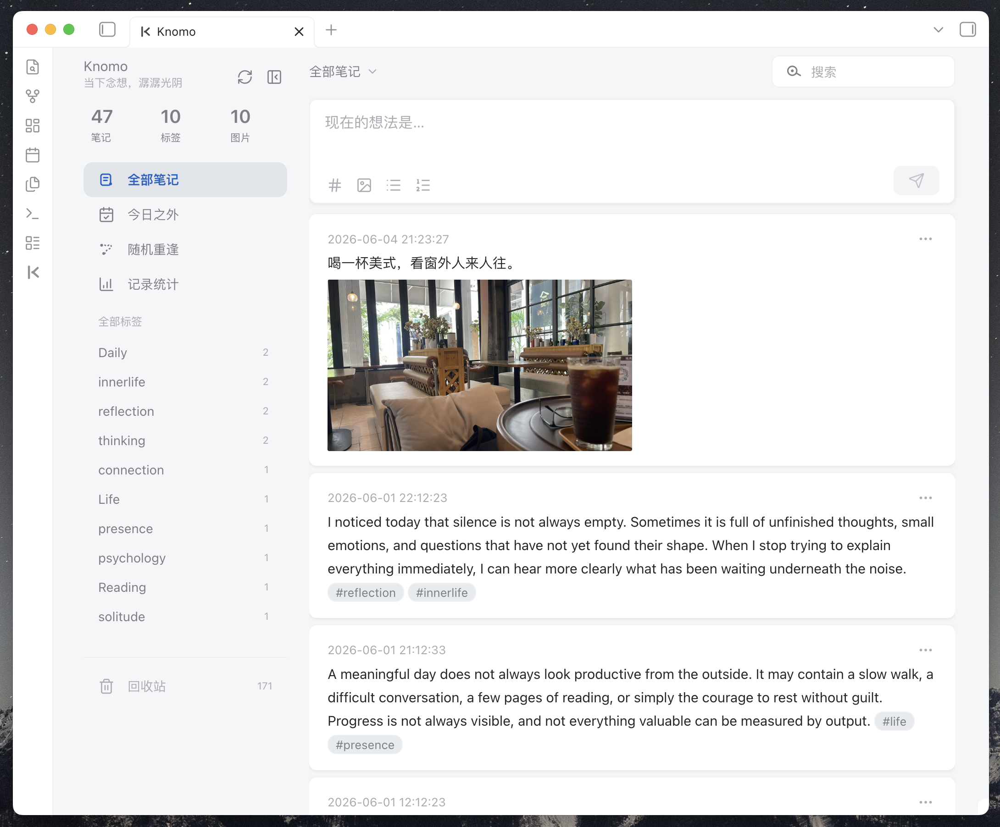
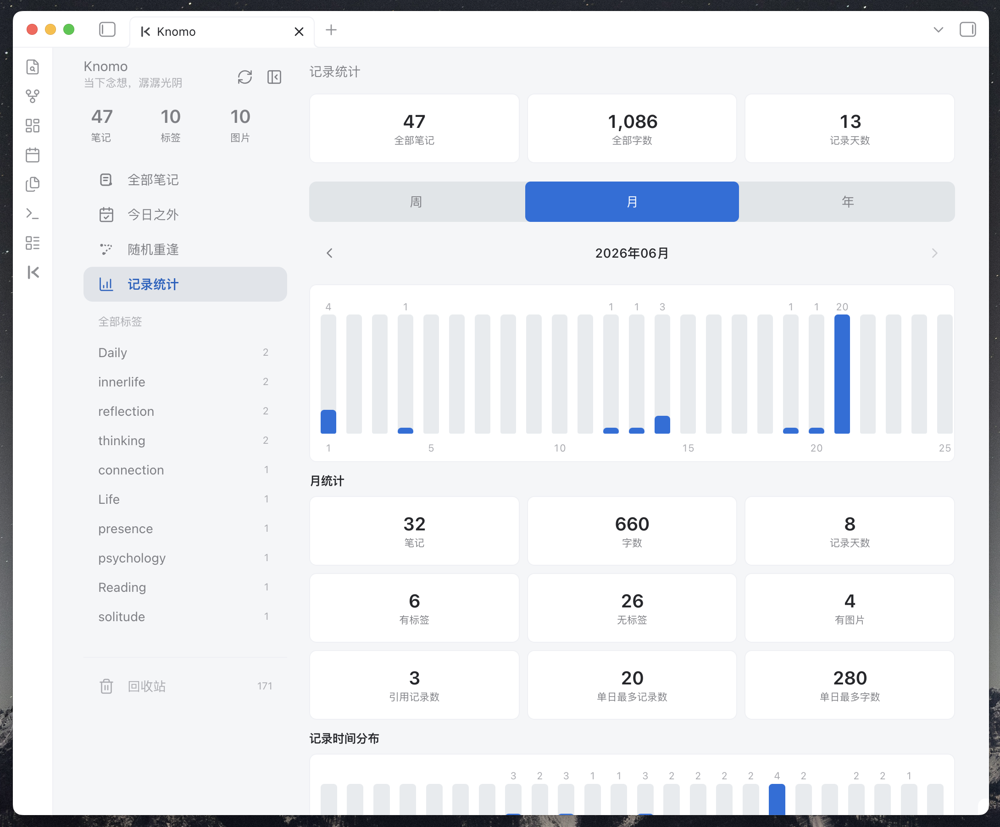
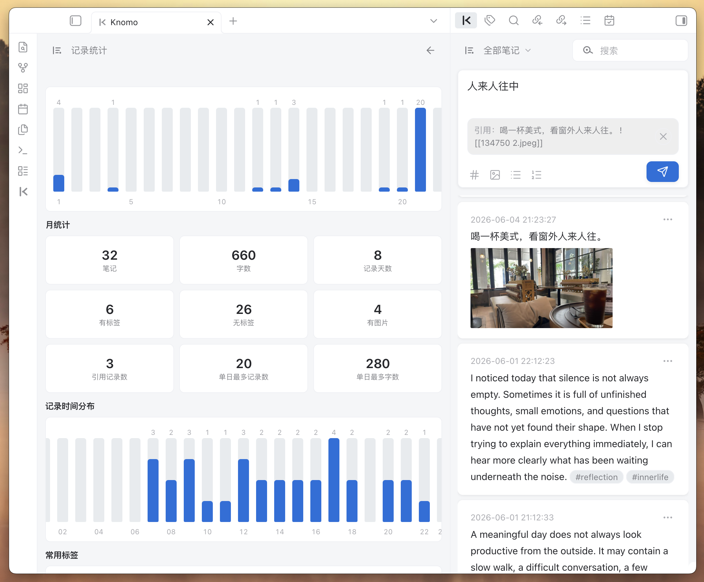
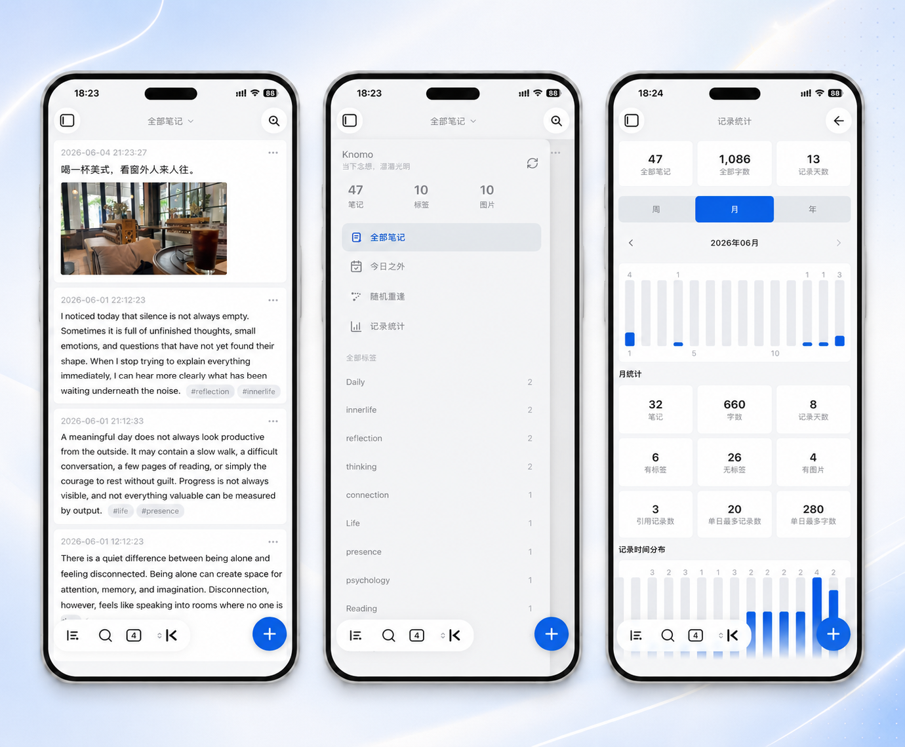

# Knomo

[English](README.md) | 简体中文

> Obsidian 里的本地优先 Memos 入口：快速记录，日记留痕，月度归集，卡片回看，移动端友好输入。

Knomo 是一个为 Obsidian 打造的 memo-first 记录插件。它帮助你更快写下碎片想法，同时让内容继续保存在自己的 Vault 里，以普通 Markdown 文件的形式存在，离开插件也能阅读、编辑和迁移。

Knomo 的核心思路很简单：

- 先快速记录，不必一开始就决定最终笔记结构；
- 通过 Daily Notes 保留每条 memo 发生的日期上下文；
- 自动生成和维护月度 Memos Markdown 文件，方便集中浏览和回看；
- 通过卡片、筛选、搜索、引用、图片、任务和统计，让写下的内容重新被看见和复用；
- 坚持本地优先，不破坏原有 Markdown 工作流。

Knomo 不试图取代 Obsidian 的文件、文件夹、标签、链接、反向链接或 Daily Notes。它只是给 Obsidian 的 Markdown 工作流增加一个更轻、更顺手的记录入口。

---

## 截图

### 桌面端







### 移动端




---

## 为什么需要 Knomo？

Obsidian 很适合长期知识管理，但很多想法并不是以完整笔记的形态出现的。它们更常见的形态是碎片：阅读时的一句话、会议里的一个点子、一个待办、一张截图、一个链接、一句判断、一个感受，或者一个还没成形的连接。

如果每个碎片都要先打开正确文件、找到正确标题、选择正确文件夹、判断最终结构，很多内容就不会被写下来。

Knomo 给这些碎片一个低摩擦入口：

1. **先记录**：打开 Knomo，写下 memo，保存。
2. **保留日记上下文**：memo 自动写入当天 Daily Note。
3. **按月归集**：Knomo 自动维护月度 Memos Markdown 文件。
4. **用卡片回看**：通过卡片流、筛选、搜索和统计重新浏览内容。
5. **回到 Markdown**：每条 memo 仍然属于你的 Obsidian 本地 Markdown 工作流。

---

## 核心理念

### Memo-first

Knomo 把 memo 作为第一记录单元。你可以先捕捉想法，再在之后连接、打标签、搜索、引用、展开或移动到更大的笔记中。

### Daily Note + Monthly Memos

Knomo 的核心工作流由两层 Markdown 组成：

- **Daily Note**：保留 memo 发生的日期和当天上下文；
- **Monthly Memos 文件**：把 memo 归集成月度信息流，方便集中浏览和回看。

Daily Note 回答：**今天发生了什么？**

Monthly Memos 回答：**这个月我写下了什么？**

### Local-first

memo 内容保存在你的 Obsidian Vault 中。Knomo 不要求账号，不依赖外部服务器，也不会主动上传你的笔记。

### Markdown-friendly

Knomo 尽量支持并保留常见的 Obsidian / Markdown 语法，包括标签、内部链接、Markdown 链接、URL、图片、列表、任务列表、块引用、引用块、标题和代码块。

### Non-destructive

Knomo 不会把你的 Daily Note 改造成插件私有数据库。它写入的是可读的 memo 形态 Markdown，并尽量保持原文可见、可编辑、可迁移。

### Mobile-friendly

Knomo 不把 Obsidian 移动端当作桌面端的缩小窗口。输入框、键盘行为、触控区域、侧边栏、搜索和卡片浏览都会围绕手机上的真实记录场景优化。

---

## 功能亮点

### 快速记录

你可以直接在 Knomo 视图里写 memo，不需要先打开某个 Markdown 文件。

适合记录：

- 碎片想法；
- 阅读摘录；
- 项目灵感；
- 会议记录；
- 工作备忘；
- 每日复盘素材；
- 临时待整理内容。

---

### 写入 Daily Note

Knomo 依赖 Obsidian 核心插件 **Daily Notes（日记）**。

新 memo 会写入当天 Daily Note 中配置好的标题下。默认标题是：

```md
## Memos
```

示例：

```md
## Memos

- 18:30:12 今天想到一个新的产品点子 #idea
- 21:10:03 书里这段话值得之后再看 #reading
```

你可以在 Knomo 设置中配置写入标题、插入位置和时间格式。

---

### 月度 Memos 文件

除了写入 Daily Note，Knomo 也会自动维护月度 Memos Markdown 文件。

默认结构示例：

```md
# Knomo/Memos-2026-06.md

## [[2026-06-21]]

- 09:20:10 一个不应该丢掉的小产品想法 #idea
- 22:15:42 复盘记录：这个之后可以整理成项目 brief #review

## [[2026-06-20]]

- 16:42:03 阅读时看到的一句有用的话 #reading
```

月度文件让你可以集中浏览长期 memo 流，同时不丢失 Daily Note 的原始日期上下文。

---

### 卡片式浏览

Knomo 用卡片流展示 memo，而不是要求你一直阅读原始 Markdown 信息流。

卡片适合：

- 快速浏览最近记录；
- 在移动端阅读；
- 查看搜索结果；
- 按标签、链接、图片或日期范围筛选；
- 打开来源 Daily Note；
- 复制文本或链接；
- 编辑、删除、恢复或引用某条 memo。

---

### 筛选与搜索

Knomo 支持多种方式缩小 memo 范围：

- 全部笔记；
- 无标签 memo；
- 有链接 memo；
- 有图片 memo；
- 今日回顾 / 同日回顾；
- 本周、本月、最近 7 天、最近 30 天、上周、上月等时间范围；
- 标签筛选；
- 关键词搜索；
- 统计页联动筛选。

对于较大的 Vault，Knomo 可以先加载最近内容，再在后台加载全量 memo，用于需要完整数据的筛选和统计。

---

### 标签、链接与 Obsidian 友好 Markdown

Knomo 会识别 memo 里的标签和链接。

```md
- 16:20:00 改进移动端 composer 的间距 #knomo #interaction
- 19:05:00 这个想法可以连接到 [[产品设计]] 和 [[移动端体验]]
- 20:10:00 参考资料：https://obsidian.md
```

Knomo 会保留原始 Markdown，而不是替换成插件私有格式。

---

### 引用卡片

当一条 memo 需要回应、延展或引用另一条 memo 时，可以从卡片操作菜单创建引用。

适合这些场景：

- 继续一个旧想法；
- 在新 memo 中引用旧 memo；
- 把分散在不同日期的碎片连接起来；
- 保留原始 memo 的来源痕迹。

引用使用 Obsidian 友好的链接或块引用形式，因此离开 Knomo 后仍然有意义。

---

### 图片预览

Knomo 支持在 memo 卡片中显示轻量图片预览。

支持的场景包括：

- Obsidian 本地图片嵌入，例如 `![[image.png]]`；
- 普通 Markdown 图片，例如 ``；
- 一条 memo 内包含多张图片；
- 从卡片中打开更大的图片预览；
- 在预览中切换上一张 / 下一张图片。

Knomo 的目标不是做图片管理器，而是让带图片的 memo 也能在卡片流里清晰、轻量地浏览。

---

### 任务列表与 checkbox

Knomo 支持 memo 中的 Markdown 任务列表。

示例：

```md
- 09:30:00
	- [ ] 发出项目记录
	- [x] 检查昨天的会议 memo
```

你可以在卡片视图中更新任务状态，并同步回源 Markdown 内容。

---

### 记录统计

Knomo 增加了记录统计视图，用来理解自己的记录习惯和回看节奏。

可以展示：

- 全部笔记数；
- 全部字数；
- 记录天数；
- 有标签笔记；
- 无标签笔记；
- 有图片笔记；
- 被引用笔记；
- 单日笔记数最多的日期；
- 单日字数最多的日期；
- 周、月、年的记录趋势；
- 记录时段分布；
- 常用标签。

统计的目的不是把写作变成生产力打卡，而是帮助你发现记录节奏，并快速跳回相关 memo 卡片。

---

### 随机重逢与回顾

Knomo 提供随机重逢、日期回顾等轻量回看入口。它们不依赖 AI，也不依赖外部服务，只是帮助旧碎片重新遇到现在的你。

一条 memo 不一定要立刻有用。有时它的价值是在另一个时间、另一个上下文里重新出现。

---

### 回收站、恢复与修复

Knomo 提供更安全的日常维护流程：

- 删除后的 memo 可以进入回收站；
- 能恢复的 memo 可以尝试恢复；
- 永久删除需要单独操作；
- 可以从 Markdown 来源修复 / 重建 memo 索引；
- 可以预览并导入历史 Daily Note 中类似 memo 的内容。

Markdown 始终是长期可信来源。插件索引用于提升浏览、筛选、统计和同步体验。

---

### 移动端输入体验

Knomo 针对移动端做了专门优化：

- 更适合触控的快速新建入口；
- 面向手机输入的底部 composer；
- 与系统键盘更好协同；
- 长内容输入时的高度和滚动控制；
- 更大的触控区域；
- 移动端搜索页；
- 移动端侧边栏抽屉；
- 移动端友好的图片预览；
- 适配安全区域和 Obsidian 移动端导航栏。

Knomo 的移动端目标不是“能打开”，而是让快速记录在 Obsidian mobile 中也足够自然。

---

### 主题兼容

Knomo 尽量使用 Obsidian 主题变量，并对 Minimal 等社区主题做了兼容处理。

如果你使用其他主题时遇到间距、颜色、对比度或移动端布局问题，欢迎反馈。

---

## 安装

### 从 Obsidian 社区插件市场安装

当 Knomo 可在 Obsidian 社区插件市场中安装后：

1. 打开 Obsidian 设置；
2. 进入 **第三方插件 / Community plugins**；
3. 如有需要，关闭安全模式；
4. 搜索 `Knomo`；
5. 安装并启用插件。

### 手动安装

1. 下载最新 Release 中的文件：
   - `main.js`
   - `manifest.json`
   - `styles.css`
2. 在你的 Vault 中创建目录：

```text
.obsidian/plugins/knomo/
```

3. 将三个文件放入该目录；
4. 重启 Obsidian；
5. 在 **第三方插件 / Community plugins** 中启用 Knomo；
6. 使用命令面板运行 `Open Knomo`。

---

## 快速开始

### 1. 启用 Daily Notes

Knomo 需要 Obsidian 核心插件 **Daily Notes（日记）**。

使用前请确认：

- Daily Notes 已启用；
- 日记文件夹路径已配置；
- 日期格式已配置；
- Obsidian 可以正常创建 Daily Note 文件。

### 2. 打开 Knomo

你可以通过以下方式打开 Knomo：

- 点击左侧 Ribbon 图标；
- 在命令面板运行 `Open Knomo`；
- 将 Knomo 视图固定到工作区。

### 3. 创建第一条 memo

写下：

```text
今天开始用 Knomo 记录碎片想法 #knomo
```

保存后，这条 memo 会出现在卡片流中，并写入对应 Markdown 文件。

### 4. 回看与连接

写一段时间后，可以尝试：

- 按标签筛选；
- 搜索关键词；
- 查看有链接 / 有图片的 memo；
- 使用随机重逢；
- 查看记录统计；
- 创建新 memo 时引用旧 memo。

---

## Markdown 格式

Knomo 使用简单、可读、离开插件也能理解的 Markdown 格式。

### 单行 memo

```md
- 18:30:12 这是 memo 内容
```

### 多行 memo

```md
- 18:30:12 第一行内容
	第二行内容
	第三行内容
```

### 带标签的 memo

```md
- 18:30:12 今天读到一个很好的观点 #reading #product
```

### 带链接的 memo

```md
- 18:30:12 这个想法可以连接到 [[产品设计]] 和 https://obsidian.md
```

### 带图片的 memo

```md
- 18:30:12 这是一张灵感截图 ![[image.png]]
```

### 带任务列表的 memo

```md
- 09:30:00
	- [ ] 跟进项目负责人
	- [x] 检查昨天的 memo
```

### 带引用块的 memo

```md
- 20:15:00
	> 一条小记录，可能会在合适的时候重新变得有用。
```

### 月度归档中的 memo

```md
## [[2026-06-21]]

- 18:30:12 这是 memo 内容
```

---

## 设置概览

Knomo 设置包括：

- Daily Note 写入标题；
- 新 memo 插入位置；
- memo 时间格式；
- 月度 Memos 文件夹；
- 月度 Memos 文件名格式；
- 月度文件中的日期标题格式；
- 月度日期排序方式；
- 可选：将月度 Memos 文件从 Obsidian 搜索 / 图谱 / 统计中排除；
- 固定标签；
- 历史 Daily Note memo 导入；
- 数据修复与重建工具。

---

## 数据与隐私

Knomo 的核心原则是：**数据属于你**。

- memo 内容保存在你的 Obsidian Vault 中；
- Daily Notes 和月度 Memos 文件都是普通 Markdown 文件；
- Markdown 文件可以直接阅读、备份、同步和迁移；
- 插件索引用于提升浏览、筛选、统计和同步体验；
- 插件索引不是唯一数据来源；
- Knomo 不要求注册账号；
- Knomo 不依赖外部服务器；
- Knomo 不会主动上传你的笔记。

---

## 数据安全说明

Knomo 会写入 Markdown 文件。为了降低风险：

- 首次使用前请备份 Vault；
- 确认 Obsidian Sync、Git 或其他同步工具状态正常；
- 导入历史 Daily Note 内容前请先备份；
- 如果卡片流与 Markdown 看起来不一致，优先检查原始 Markdown；
- 如果索引过期，可以使用修复 / 重建工具；
- 长期可信来源始终是 Markdown 文件。

Knomo 的目标不是隐藏 Markdown，而是让 Markdown 更容易被快速记录、浏览和复用。

---

## 推荐工作流

### 日常碎片记录

把 Knomo 当作 Obsidian 里的快速输入框。先写下来，之后再整理。

### 阅读摘录

```md
- 10:32:00 重点不是功能数量，而是用户完成目标时走过的路径。 #reading #product
```

### 项目灵感池

```md
- 16:20:00 移动端输入框应该像一个安静地浮在键盘上方的面板。 #knomo #interaction
```

### 任务捕捉

```md
- 09:30:00
	- [ ] 写 release note 草稿
	- [ ] Review 移动端卡片布局
```

### 图片灵感

```md
- 18:30:12 紧凑卡片布局参考 ![[card-layout-reference.png]] #design
```

### 回看与复用

通过标签、搜索、随机重逢、记录统计和引用，让旧的碎片重新进入当前工作。

---

## Knomo 不是什么

Knomo 不是：

- Obsidian 文件和文件夹系统的替代品；
- 云端 memo 服务；
- AI 笔记整理器；
- 完整任务管理器；
- 图片管理器；
- 把内容锁住的私有数据库。

Knomo 是 Obsidian Markdown 的本地 memo-first 记录与回看层。

---

## 与其他工具的区别

### Knomo 和 flomo 有什么区别？

flomo 是独立的 Memos 产品。Knomo 是 Obsidian 插件。

Knomo 更适合希望把碎片记录保存在自己 Vault 中，并继续使用 Obsidian 标签、链接、搜索、反向链接、Daily Notes 和 Markdown 工作流的用户。

### Knomo 和 Thino 有什么区别？

Thino 是成熟的 Obsidian Memos 插件。

Knomo 更聚焦：

- Daily Note 联动；
- 月度 Markdown 自动归集；
- 本地优先的 memo 存储；
- 移动端输入体验；
- 轻量卡片回看；
- 低打扰的个人记录流程。

如果你需要成熟、完整、功能丰富的 Memos 插件，Thino 可能更适合。如果你想要一个贴近日记和本地 Markdown 的轻量记录入口，可以试试 Knomo。

---

## 常见问题

### Knomo 会不会把数据锁在插件里？

不会。核心 memo 内容会写入 Markdown 文件。索引用于提升体验，但 Markdown 才是长期可信来源。

### 是否必须启用 Daily Notes？

是的。Knomo 的主要写入流程围绕 Obsidian 核心插件 Daily Notes 展开。

### Knomo 会上传我的笔记吗？

不会。Knomo 不依赖外部服务器，也不会主动上传你的笔记。

### 是否支持移动端？

支持。移动端是 Knomo 的重点优化方向之一。Knomo 包括移动端 composer、键盘适配、移动搜索、触控友好控件、安全区域处理、移动端侧边栏和卡片浏览等优化。

### 为什么卡片流和 Markdown 文件看起来不一致？

可能是索引尚未刷新，或者 Markdown 文件被外部编辑后还没有重新同步。

可以尝试：

1. 检查原始 Markdown 文件；
2. 刷新 Knomo；
3. 使用修复 / 重建工具；
4. 如果问题仍然存在，提交带复现步骤的 issue。

### 可以手动编辑 Markdown 文件吗？

可以。Knomo 的设计目标就是让内容保持 Markdown 可读。如果你手动编辑文件后卡片流没有及时更新，可以刷新或重建索引。

---

## 反馈与贡献

欢迎反馈，尤其是：

- Bug 报告；
- 移动端体验问题；
- 主题兼容问题；
- Markdown 解析边界；
- 数据同步 / 索引修复问题；
- UI / UX 建议；
- 文档改进。

反馈移动端问题时，建议附上设备型号、系统版本、Obsidian 版本、主题和复现步骤。

---

## License

### Knomo 适用于 Obsidian 桌面端和移动端

Knomo 采用 MIT 许可证。你可以自由使用、复制、修改、合并、发布、分发、再授权或出售本软件的副本，但需要在代码的重要部分中保留版权声明和许可证声明。

这也包括你可能从 Knomo 中提取出来的独立代码片段、样式、组件或工具函数。

如果你分发 Knomo 的分支版本，或复用其中一部分代码，欢迎在你的 README 中保留指向原项目的链接和保留我的 [Buy me a coffee](https://www.buymeacoffee.com/banyanso) 链接。

Knomo 是为 Obsidian 设计的，并可能持续更新，以适配新版 Obsidian，包括桌面端、移动端以及 Minimal 等社区主题的体验改进。

详情请查看 [LICENSE](./LICENSE) 文件。
